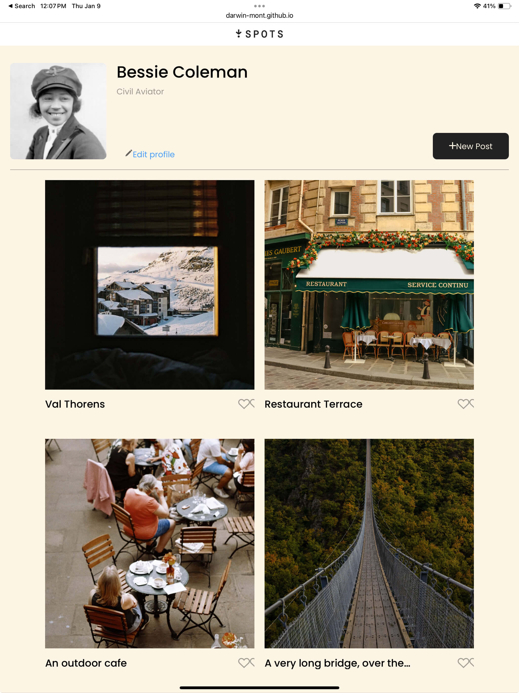
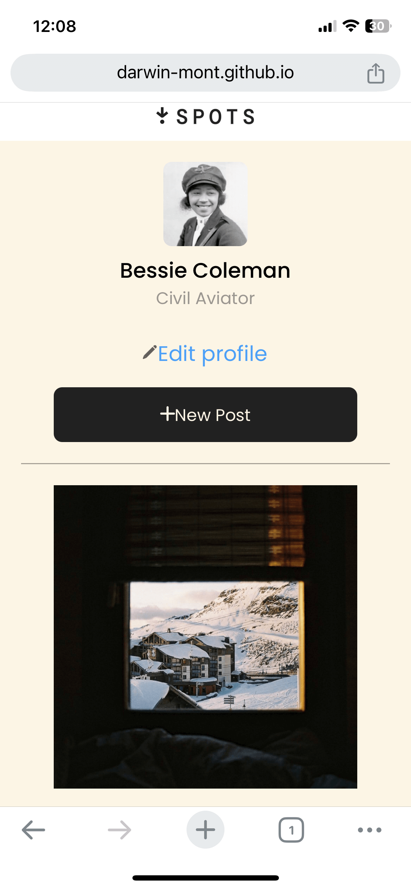

# Project's name:

Project 3: Spots

## Description of the project and functionality

Adaptive site for picture sharing.
Site created to share pictures amoung users, you can create a profile and upload your own pictures.
It adapts to two different screen sizes, mobile and desktop.
The content in the site will adjust to either size acordingly.

## Tech Stack

To do this project i've use _HTML_ for coding and
to style it i've use _CSS_ with the _BEM_ parameters apply to both of them.
A new method was apply called, _ADAPTIVE DESIGN_ so that the
site adjusts it self to diferent sizes of screen.

## Visuals

## Deployment Project

This is the link for the site on _Github Pages_

[Spots](https://darwin-mont.github.io/se_project_spots/)

https://darwin-mont.github.io/se_project_spots/
